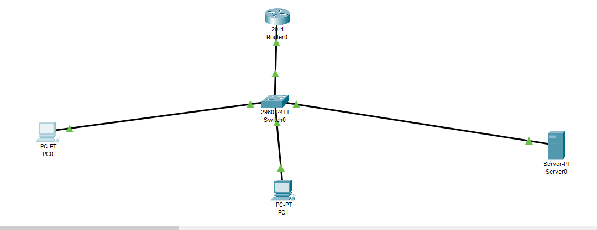

# ☁️ Secure Hybrid Cloud Network Infrastructure

## 📌 Project Overview
This project demonstrates a professional implementation of a **Secure Hybrid Cloud Network** using Cisco Packet Tracer. It focuses on network segmentation, secure access control, and edge connectivity to simulate a corporate environment connecting to cloud resources.

---

## 🏗️ Network Architecture
The network follows a **Router-on-a-Stick** design to enable communication between isolated VLANs while maintaining security at the network edge.

### 🌐 Network Topology:

---

## 🛠️ Key Technical Features

### 1. Inter-VLAN Routing
The network is logically segmented into three primary departments to ensure isolation:
* **VLAN 10 (Management):** Dedicated for network administration and infrastructure control.
* **VLAN 20 (Cloud Servers):** Hosting critical applications and web services.
* **VLAN 30 (Users):** General staff access with restricted permissions.

### 2. Network Security (Extended ACLs)
Strict security policies are enforced using **Extended ACL 110**:
* **Permit HTTP (Port 80):** Allows users to access the web services hosted on the cloud servers.
* **Deny ICMP (Ping):** Blocks ICMP traffic from the User VLAN to the Server VLAN to prevent network reconnaissance and discovery.
* **Implicit Deny:** All other unauthorized traffic is blocked by default.

### 3. NAT/PAT (Internet Edge)
Configured **NAT Overload (PAT)** to allow internal private IP addresses to access the external network/Internet through a single public IP interface.

---

## 📂 Project Structure
* **`01_Architecture/`**: Contains the Packet Tracer file (.pkt) and the topology image.
* **`02_Configuration/`**: Includes the full Cisco IOS running-config for the Edge Router.
* **`03_Documentation/`**: Detailed IP addressing schema and security policy documentation.

---
**👨‍💻 Developed by:** [Mohamed Ramadan]  
**Topic:** Networking & Cloud Infrastructure Simulation
